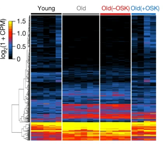
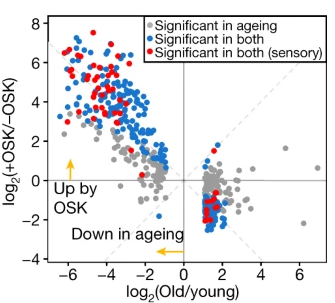

[Final Project R Script](https://github.com/ShannonBa/Data_Course_BAKER/blob/main/Final_Project/Final_Project_script.R)

My final project review how images were created to analyze what genes in mice affect aging and how these genes can be changed to reverse aging in mice. 

[Reprogramming to recover youthful epigenetic information and restore vision](https://rdcu.be/ch1re)


```{r include=FALSE}
## load packages
library(tidyverse)
library(janitor)
library(dplyr)
library(gplots)
library(ggplot2)
library(viridis)
library(RColorBrewer)
```

#### Images I am trying to recreate: 
<div style="width: 100%; height: 400px; overflow: hidden">
 
   <div class="centered">Centered</div>
</div>
This heatmap shows the genes that are actively expressed in young mice and 
those that are less active in old mice. 

<div style="width: 100%; height: 400px; overflow: hidden">
 
   <div class="centered">Centered</div>
</div>
This volcano plot shows the genes that are significantly active in young mice, those genes that have decreased expression in old mice, and those genes that are increased in old mice with the OSK genes being expressed.


#### From the paper, there was no RStudio code avaialable, but the data used to create the two graphs was available.
```{r echo=FALSE}
### load data

df <- read_csv("./41586_2020_2975_MOESM11_ESM.csv", skip=3)
names(df)
names(df) <- names(df) %>% str_replace_all(" ","_")
nam <- "logFC (12 mo (+OSK)/12 mo (-OSK))"
nam %>% str_replace_all(" ","_")
glimpse(df) 
```
There are 464 genes analyzed over 5 5-month old mice, 6 12-month old mice with no OSK AAV added, 5 12-month old mice with an AAV added but with no OSK genes expressed, and 4 12-month old mice with the OSK genes being expressed. 


```{r include=FALSE}
heatdf <- df[ ,c(                
  "5_mo_rep2"  ,                      
  "5_mo_rep3"   ,                     
  "5_mo_rep4"    ,                    
  "5_mo_rep5"     ,                   
  "12_mo_rep1" ,                      
  "12_mo_rep2"  ,                     
  "12_mo_rep3"  ,                     
  "12_mo_rep4"   ,                    
  "12_mo_rep5"    ,                   
  "12_mo_rep6"     ,                  
  "12_mo_(-OSK)_rep1",                
  "12_mo_(-OSK)_rep2" ,               
  "12_mo_(-OSK)_rep3"  ,              
  "12_mo_(-OSK)_rep4"   ,             
  "12_mo_(-OSK)_rep5"    ,            
  "12_mo_(+OSK)_rep1"     ,           
  "12_mo_(+OSK)_rep2" ,               
  "12_mo_(+OSK)_rep3"  ,              
  "12_mo(+OSK)_rep4")]
```

This is the heatmap created.
```{r echo=FALSE}
#### Making heatmap ####
heat_matrix <- as(heatdf, "matrix")
rownames(heat_matrix) <- df$gene

#color coding
mousenames <- c(rep("Young",4),
                rep("Old",6),
                rep("Old(-OSK)",5),
                rep("Old(+OSK)",4))
mousecolors <- plyr::mapvalues(mousenames,
                               from = unique(mousenames),
                               to=c("Black","Gray","Red","Blue"))
gene_colors <- viridis::magma(dim(heat_matrix)[1])


#actual heatmap
heatmap(heat_matrix, Colv = NA,
        ColSideColors = mousecolors,
        margins = c(10,10),
        col=gene_colors)
```

This is the volcano plot I was able to make. 
The volcano plot was made from the QValues, as the p-value can give the expected false positive rate obtained by rejecting the null hypothesis for any result with an equal or smaller p-value, the q-value gives the expected pFDR obtained by rejecting the null hypothesis for any result with an equal or smaller q -value
```{r echo=FALSE}
df %>%
  mutate(Color = case_when(QValue < 0.05 & QValue_2 > 0.05  ~ "red",
                           QValue > 0.05 & QValue_2 < 0.05 & QValue_1 < 0.05  ~ "Significant in both",
                           QValue < 0.05 & QValue_1 > 0.05  ~ "unknown1",
                           QValue < 0.05 & QValue_2 < 0.05  ~ "Significant in both (sensory)",
                           QValue > 0.05 & QValue_2 > 0.05  ~ "Significant in ageing",
                           QValue > 0.05 & QValue_1 < 0.05  ~ "Significant in both",
                           QValue > 0.05 & QValue_1 > 0.05  ~ "unknown2"))%>%
  ggplot(aes(x=`logFC_(12m/5m)`, y=`logFC_(12_mo_(+OSK)/12_mo_(-OSK))`, color=Color)) + geom_point() +
  scale_color_manual(values = c("grey", "blue", "red","green","yellow","black","brown")) +
  geom_hline(yintercept=0, color= "grey", size= 1.0) +
  geom_vline(xintercept = 0, color= "grey", size= 1.0) +
  geom_abline(intercept = 0, slope = -1, color="grey", 
              linetype="dashed", size=1.0) +
  geom_abline(intercept = 0, slope = 1, color="grey", 
              linetype="dashed", size=1.0)+
  theme(panel.grid.major = element_blank(), panel.grid.minor = element_blank(),
        panel.background = element_blank(), axis.line = element_line(colour = "black"))+
  labs( x ="log2(Old/Young)", y = "log2(+OSK/-OSK)") +
  annotate("text", x=-1.5, y=-2, label= "Down in ageing") + 
  annotate("segment", x = 0, xend = -1.5, y = -3, yend = -3, colour = "#ffce42", size=1, alpha=1, arrow=arrow(length = unit(0.1, "inches"), ends = "last", type = "closed"))+
  annotate("text", x=-6, y=-.25, label= "Up by OSK") + 
  annotate("segment", x = -6, xend = -6, y = 0, yend = 1, colour = "#ffce42", size=1, alpha=1, arrow=arrow(length = unit(0.1, "inches"), ends = "last", type = "closed"))


```


___

[Home](https://shannonba.github.io/index.html) | [About me](https://shannonba.github.io/AboutMe) | [Final Project](https://shannonba.github.io/Final_Project) | [Hobbies](https://shannonba.github.io/Hobbies)

<style>
  body {
    background-color: #FFEABF;
    margin-top: 50px;
  }

 /*Navigation Panel*/
  /*Navigation panel position - ul, li, li a, and .active*/
    ul{
      list-style-type: none;
      margin: 0; /*Top Margine*/
      padding: 0; /*Padding of HOME from the edge*/
      overflow: hidden;
      background-color: #333;
      position: fixed;
      top: 0; /*Does Nothing*/
      width: 100%; /*Does Nothing*/
      }
    ul {
        position: fixed;
        top: 0; /*Does Nothing*/
        width: 84%; /*Adjusts the width of the background on the NAVIGATION BAR.*/
      }
    li {
        float: left;
      }
    li a {
        display: block;
        color: white;
        text-align: center;
        padding: 14px 16px;
        text-decoration: none;
      }
    li a:hover:not(.active) {
        background-color: #111;
      }
    .active {
        background-color: #F0BB53;
      }
</style>

  <ul>
    <li><a href="index.html">Home</a></li>
    <li><a href="AboutMe.html">About Me</a></li>
    <li><a class="active" href="Final_Project.html">Final Project</a></li>
     <li><a href="Hobbies.html">Hobbies</a></li>
  </ul>