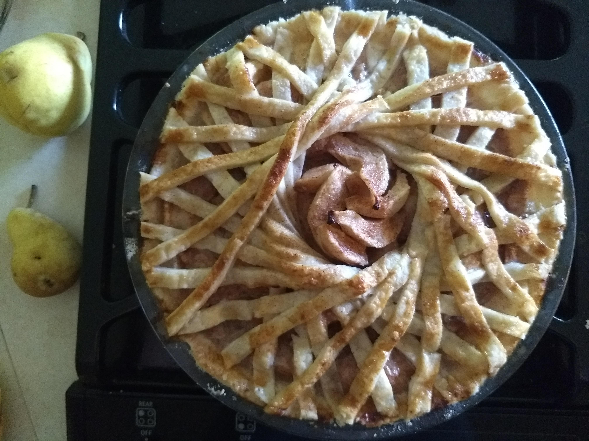
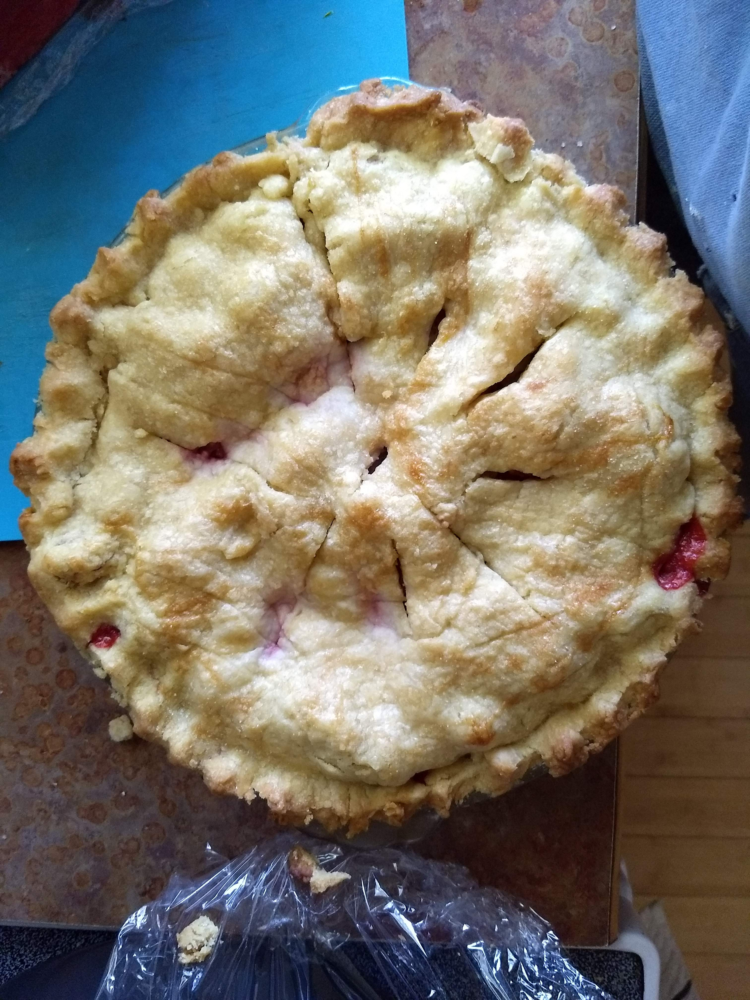
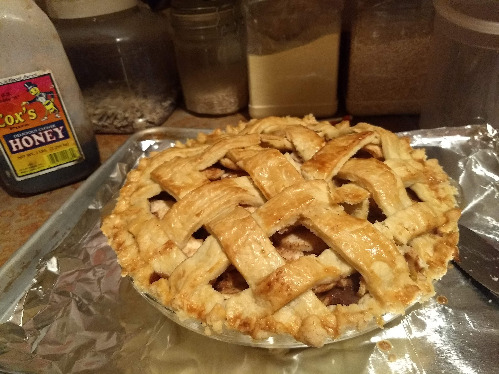

#
I enjoy eating chocolate and making pies. I spend my free time reading fiction and annoying my sisters with nothingness.  
   

___

[Home](https://shannonba.github.io/index.html) | [About me](https://shannonba.github.io/AboutMe) | [Final Project](https://shannonba.github.io/Final_Project) | [Hobbies](https://shannonba.github.io/Hobbies)

  <ul>
    <li><a href="index.html">Home</a></li>
    <li><a href="AboutMe.html">About Me</a></li>
    <li><a href="Final_Project.html">Final Project</a></li>
     <li><a  class="active" href="Hobbies.html">Hobbies</a></li>
  </ul>